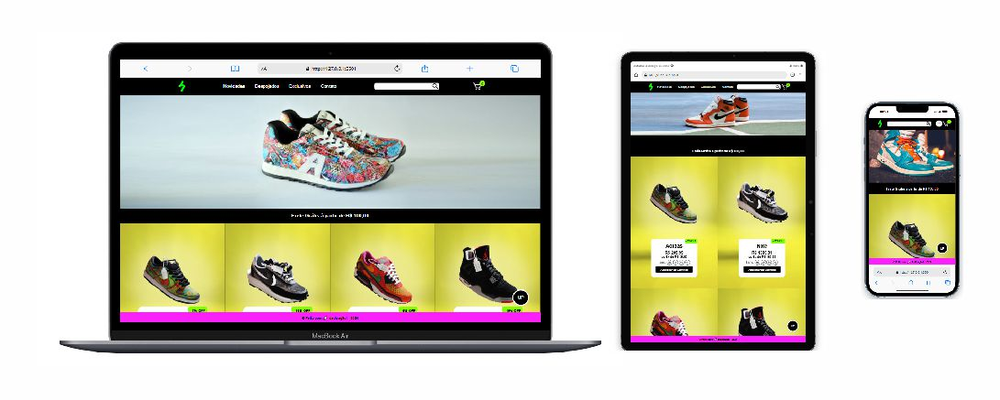

# ⚡ Projeto
## 🚀 Bem-vindo ao projeto Loja Virtual - HubVibe Shoes!
#### Este projeto foi desenvolvido em:

1. HTML5
2. CSS3
3. JavaScript

## Conceitos Principais
- **Microserviços Frontend**: Implementação do conceito de microserviços para facilitar a manutenção do código.
- **LocalStorage**: Utilização do LocalStorage para salvar as interações do usuário.
- **ES6**: Aplicação das melhores práticas do ES6 para um código mais limpo e eficiente.
- **Customizações**: Implementação de diversas customizações para melhorar a experiência do usuário, como a funcionalidade de pesquisar produtos.
- **Responsividade**: O design se adapta a diferentes tamanhos de tela, garantindo boa navegação em dispositivos móveis e desktops.
- **SPA**: A aplicação é uma Single Page Application, proporcionando uma navegação fluida sem recarregamentos de página.

### Biblioteca SweetAlert2
O projeto utiliza a biblioteca **SweetAlert2** para exibir alertas e mensagens modais de forma elegante e interativa.

- Foi adicionado esta linha de comando no final do `<body>`:
    ```html
    <script src="https://cdn.jsdelivr.net/npm/sweetalert2@11" defer></script>
    ```
#### Funcionalidades Principais:
- **Alertas Personalizáveis**: Permite criar alertas com diferentes estilos, ícones e botões personalizados.
- **Confirmação de Ações**: Solicita confirmação do usuário antes de ações críticas.
- **Mensagens de Feedback**: Fornece feedback visual em resposta a ações do usuário.

#### Exemplos de Uso:
- Exibição de mensagens de aviso em buscas sem resultados.
- Confirmação de exclusão de produtos do carrinho.

## Observações Adicionais
Projeto desenvolvido com responsividade e semântica, proporcionando uma experiência otimizada.

## Pré-requisitos
Ter a extensão Live Server instalada no Visual Studio Code.



- Clique com o botão direito do mouse em cima do arquivo `index.html`.
- Escolha a opção **Open With Live Server** para subir a aplicação no localhost.
- E pronto! Boas Compras!

## Créditos das Imagens
As imagens utilizadas neste projeto foram obtidas na [Pexels](https://www.pexels.com).
